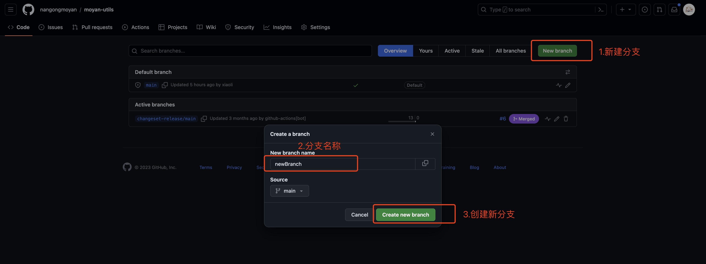

# moyan-utils

##### 记录一些复杂业务场景使用的 js 类库

> 欢迎有想法, 热衷技术的小伙伴一起共建啦! 致力于打造最好用的前端工具库, 您可以提 issue 或者 pr 来共建项目，谢谢.

## Installation

```
npm i moyan-utils
```

## All Function List

- 常用判断函数

  - isEmpty - 判断空对象
  - isMatchDataType - 判断数据类型

- 数据结构相关

  - chunk - 数组拆分
  - cloneDeep - 数据深拷贝
  - flatten - 数组扁平化
  - formatNumber - 数字千分位展示
  - get - 获取数据的值
  - getDataType - 获取数据类型
  - omit - 生成忽略属性的新对象
  - omitBy - 生成经 predicate 判断为假值的属性的对象
  - pick - 生成选中属性的新对象
  - pickBy - 生成经 predicate 判断为真值的属性的对象

- 高级函数

  - memoize - 记忆函数

- 数学计算

  - getRandomColor - 获取随机颜色

## To Develop

1.先将项目远程仓库克隆到本地

```
git clone git@github.com:nangongmoyan/moyan-utils.git
```

2.创建新功能函数对应的分支

  - 通过远程仓库链接中创建（**推荐**），这样子能确保从main分支切出来的分支是最新的

  [branches链接](https://github.com/nangongmoyan/moyan-utils/branches)

  

  - 通过命令创建分支
  ```
  git checkout -b newBranch
  ```

3.Build

  功能函数编写测试完成后，执行build
  ```
  npm run build
  ```
  
4.Push

  在执行`npm run build`后，修改package.json中version值（将值+1），然后进行当前分支push到远程仓库。
  功能是否上线，后续管理员会进行审核，在审核通过后进行merge，github 会自动执行npm-publish.yml文件将新版本更新到npm上

